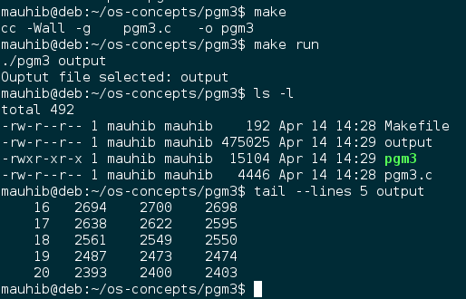
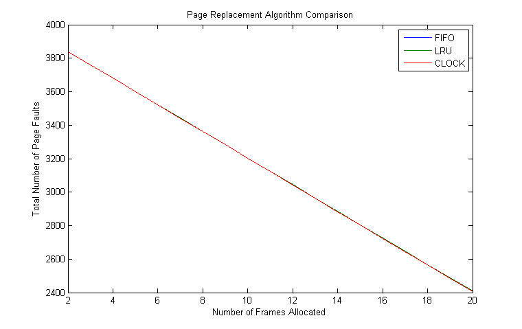
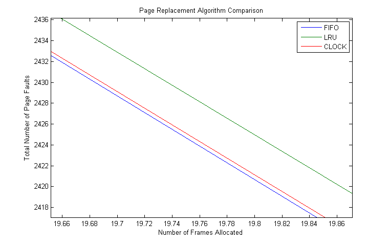

#Program 3 – Simulation of Page Replacement Algorithms

##Problem Statement
 The assignment was to perform Monte Carlo simulations of different memory page replacement algorithms and measuring the number of page faults. The memory page replacement algorithms were FIFO (first-in-first-out), LRU (least recently used), and CLOCK. The simulation data was then supposed to be used to create a plot of page faults vs. the number of frames allocated. The plot was expected to look like figure 8.17 from Operating Systems by William Stallings.

##Approach
 For this experiment I am using Debian Linux running on a dual-core system. I used the ANSI C programming language for my design. My design consists of using a frame struct called _frame\_t_ to simulate memory frames, which has a variable inside it called _page\_id_ for simulating a page being loaded into memory. The _generateAddressArray()_ function is used for generating an array of random page address references. The function just uses C's _rand()_ function and hence generates pseudorandom numbers from an almost uniform probability distribution. The most important function in my design is _simulate()_, which simulates a given algorithm, on a frame array, using an address array. It uses the algorithm parameter to determine which algorithm will be simulated. The _main()_ function in my program calls the simulate function() multiple times to simulate different algorithms with different numbers of frames allocated. Additionally, the _DEBUG_ constant can be set to 1 to see the frame array after each iteration.

##Solution
 The build environment just consists of a Makefile. To compile from source, _make_ and _gcc_ are required. Building is simple: change into the directory and run the command &quot;_make_&quot;. Once the program compiles. It can either be run using the pgm3 file that was compiled or for simplicity, just &quot;_make run_&quot; to run the program with default command line arguments. This stores the output data in the file called _output_. After this I imported the files into MATLAB, averaged up all the simulations and ran the plot() function to generate the plot in this report. The following picture shows an example build and execution of the program.

 

The following was the MATLAB code I used:

``` matlab
A=dlmread('./output','',1,0);
B=reshape(A.',4,19,1000);
C=permute(B,[2 1 3]);
D=mean(C,3);
plot(D(:,1),D(:,2),D(:,1),D(:,3),D(:,1),D(:,4));
legend('FIFO','LRU','CLOCK');
title('Page Replacement Algorithm Comparison');
xlabel('Number of Frames Allocated');
ylabel('Total Number of Page Faults');
```

The plots provided below were generated using the default configuration of the program: 50 Pages, 2-20 Frames, 4000 references, and 1000 simulations. These parameters can easily be changed by changing the constants defined on top of the pgm3.c file.

##Analysis of Plots
 The plots provided below were generated from the same data. The second plot is just a zoomed in version of the first plot. The lines produced by each of the three algorithms look almost linear, which was not expected. An exponential curve was expected for each. The description of the plot provided in the book states &quot;The results are based on the execution of 0.25 × 10^6 references in a FORTRAN program, using a page size of 256 words.&quot; It is important to note that my solution depended on C's rand() function for generating random numbers of a uniform distribution. The author using references of a computer program. Computer programs have loops and conditional statements, causing consecutive repeated references. This is known the concept of locality. Generating random numbers from a uniform distribution does not give us locality. On the other hand, I would argue that generating random numbers from a uniform distribution gives us the worst-case program references and allows us to test each of the algorithms in the worst-case scenario.
 The first plot shows that the algorithms are almost equal in the worst-case because the plots are overlapping. When we zoom-in on the high-frames area, we see that FIFO causes the least number of faults, while LRU causes the most number of faults. CLOCK has almost the same number of faults as FIFO. I think this gives us another incentive to use CLOCK as the page replacement algorithm, because it is not as bad as LRU in the worst-case.
 
 